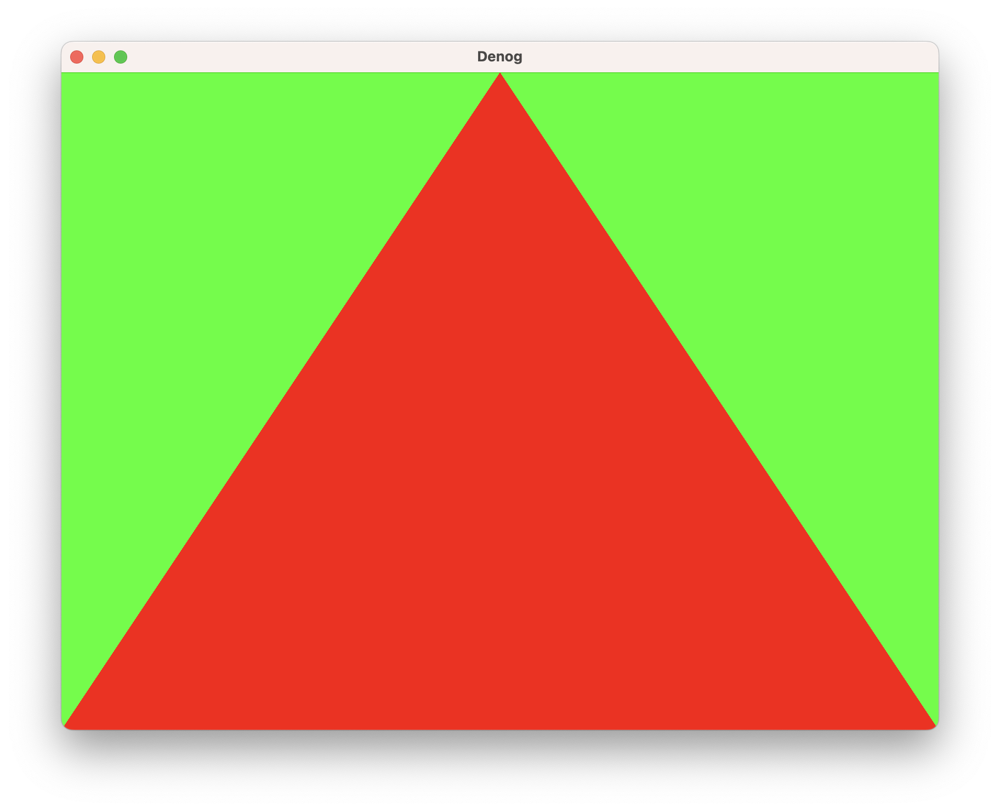

# hello-triangle

Ported from [wgpu](https://github.com/gfx-rs/wgpu/tree/v0.13.2/wgpu/examples/hello-triangle).

This example renders a triangle to a window.

## To Run

```
denog run --unstable --wsi https://raw.githubusercontent.com/denogdev/denog/v0.7.0/examples/hello-triangle/main.ts
```

## Screenshots


